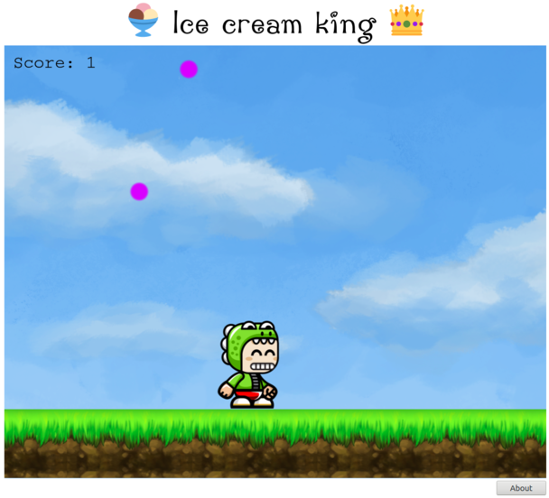

# IceCreamKing
A simple game done in phaser, where you play a little boy who wants to catch as much ice cream as possible.

## Current Status

## TODO

* Mobile support
* split game.js using webpack
* Resize on orientation change
* PWA
* Boy should have different look
* Multiple ice cream colors
* Game Menu
* Highscores
* Bad objects which need to be evaded
* Multiplayer

## Credits
[Tiles](http://www.ludicarts.com/free-game-platform-tileset/)
[Boy](https://opengameart.org/content/bevouliin-free-game-sprites-crocodile-mascot-running-and-jumping-boy-game-character)
[Font](https://www.dafont.com/de/action-jackson.font?l[]=10&l[]=1)
